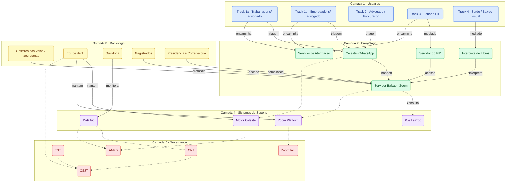

# Mapa de Atores — Balcão Virtual TRT18
*Service Blueprint · Metodologia: camadas de atores com camada de governança*

---

## Decisões Estruturais

| # | Dimensão | Decisão | Justificativa (rodada do grill) |
|---|---|---|---|
| 1 | Metodologia | Service blueprint com camadas de atores | Ancora cada hipótese de fricção na camada certa da jornada; stakeholder map ou ecosystem map deixariam H1–H3 sem posição diagnóstica (Q1) |
| 2 | Fases da jornada | 6 fases — inclui "Triagem via Celeste" entre pré-atendimento e agendamento | H1 (rigidez algorítmica) e H3 (atrito no handoff) concentram-se nessa fase; colapsá-la em pré-atendimento oculta o eixo diagnóstico principal (Q2) |
| 3 | Tracks de usuário | 4 tracks paralelos: 1a/1b trabalhador+empregador · 2 advogado · 3 PID · 4 Balcão Visual | Balcão Visual tem ator frontstage exclusivo (intérprete); empregador funde com Track 1 como variante para não explodir o diagrama (Q3) |
| 4 | Posicionamento da Celeste | Frontstage (não sistema de suporte) | Falhas H1 e H3 são de experiência do usuário, não de infraestrutura; classificar como sistema mascararia a camada de intervenção correta (Q4) |
| 5 | Camada de Governança | Camada 5 dedicada abaixo dos sistemas de suporte | Redesenho bate em tetos regulatórios reais: troca de plataforma depende de CSJT, expansão de IA depende de ANPD — sem a camada, recomendações flutuam sem âncora política (Q5) |
| 6 | Servidor de Atermação | Ator frontstage separado do Servidor do Balcão | Canal próprio (WhatsApp 62 3222-5570), fase distinta (encaminhamentos), fricção própria: fluxo pós-balcão pouco sinalizado ao usuário (Q6) |
| 7 | Gestores das Varas / Secretarias | Ator backstage próprio, separado da Presidência/Corregedoria | Corregedoria aprova mudanças estruturais; Gestores ajustam escalas operacionais diárias — alavanca direta para mitigar H4 (fadiga do Zoom) (Q7) |
| 8 | DataJud | Camada 4 — sistemas de suporte | CNJ consome os dados mas não opera o sistema; DataJud (C4) alimenta CNJ (C5) — fundir os dois confundiria instrumento tecnológico com ator regulatório (Q8) |
| 9 | Hipóteses de fricção | Incluídas no mapa, ancoradas por ator e fase | Mapa sem hipóteses é organograma; ancorar H1–H6 transforma o artefato em roteiro de pesquisa e intervenção (Q9) |
| 10 | Formato do artefato | Híbrido: Mermaid + tabela de atores + seção de decisões estruturais | Tabela matricial com 6 fases e 20+ atores fica ilegível em markdown; os três componentes juntos servem para workshop e para avaliação (Q10) |

---

## Diagrama de Ecossistema

> **Legenda de cores:**
> Azul — Usuários · Verde — Frontstage · Amarelo — Backstage · Roxo — Sistemas · Vermelho — Governança
>
> Setas sólidas = interações diretas na jornada · Setas tracejadas = dependências tecnológicas e regulatórias

---

## Fases da Jornada

| # | Fase | Descrição |
|---|---|---|
| 1 | **Pré-atendimento** | Descoberta do serviço; acesso ao portal trt18.jus.br; orientação inicial |
| 2 | **Triagem via Celeste** | Contato via WhatsApp (62 3222-5000); navegação nos menus do chatbot |
| 3 | **Agendamento** | Confirmação de data/hora e link Zoom via Celeste ou canal alternativo |
| 4 | **Atendimento** | Sessão síncrona via Zoom com servidor do balcão |
| 5 | **Pós-atendimento** | Encaminhamentos por WhatsApp ou e-mail; orientações escritas |
| 6 | **Encaminhamentos** | Ações derivadas: atermação verbal, peticionamento no PJe, acesso a PID |

---

## Tabela de Atores

| Ator | Camada | Tipo | Tracks | Fases ativas | Responsabilidade principal | Fricção / hipótese associada |
|---|---|---|---|---|---|---|
| Trabalhador sem advogado | ① Usuário | Externo | 1a | Todas | Obtém informações processuais sem representação legal | Letramento digital limitado; risco de loop na Celeste |
| Empregador sem advogado | ① Usuário | Externo | 1b | Todas | Defende-se ou busca informações sem advogado | Idem Track 1a; papel processual oposto |
| Advogado / Procurador | ① Usuário | Externo | 2 | Todas | Consulta técnica em nome de clientes; integra ao PJe | Menor fricção; pode preferir acesso direto ao PJe |
| Usuário excluído digital | ① Usuário | Externo | 3 | Todas (mediadas) | Acessa o serviço via PID com auxílio de servidor | **H5** Barreira de agendamento com SGJ (sgj@trt18.jus.br); dependência de deslocamento físico |
| Usuário surdo (Balcão Visual) | ① Usuário | Externo | 4 | Atend., Pós, Encam. | Atendimento mediado por intérprete de Libras | **H6** Horário restrito 12h–16h; barreira linguística na Celeste; dependência de intérprete |
| **Celeste** (chatbot WhatsApp) | ② Frontstage | Tecnológico | 1a, 1b, 2 | Triagem, Agend. | Triagem automatizada e agendamento via WhatsApp (62 3222-5000) | **H1** Rigidez Algorítmica · **H3** Atrito no Handoff |
| **Servidor do Balcão** | ② Frontstage | Interno | Todos | Atend., Pós | Atendimento síncrono via Zoom; consulta PJe; orienta encaminhamentos | **H2** Opacidade da Fila · **H4** Fadiga do Zoom (Bailenson, 2021) |
| **Intérprete de Libras** | ② Frontstage | Externo/Parceiro | 4 | Atend., Pós | Mediação linguística entre usuário surdo e servidor | **H6** Disponibilidade limitada; parceria TRT15 é estruturalmente frágil |
| **Servidor do PID** | ② Frontstage | Interno | 3 | Todas | Mediação completa da jornada do usuário excluído digital | **H5** Cobertura geográfica dos PIDs no interior de Goiás |
| **Servidor de Atermação** | ② Frontstage | Interno | 1a, 1b, 3 | Encam. | Formaliza demanda trabalhista verbal sem advogado (WhatsApp 62 3222-5570) | Fluxo de encaminhamento pós-balcão pouco sinalizado ao usuário |
| Gestores das Varas / Secretarias | ③ Backstage | Interno | — | Pré-atend., Atend. | Escalas de atendimento; protocolos operacionais | **H4** Sem visibilidade em tempo real sobre carga cognitiva dos servidores |
| Equipe de TI e Infraestrutura | ③ Backstage | Interno | — | Todas | Manutenção de Celeste, Zoom e PJe; suporte em tempo real | Ponto único de falha para todos os canais digitais simultâneos |
| Ouvidoria | ③ Backstage | Interno | — | Pós, Encam. | Gestão de reclamações; alimentação do DataJud | Canal de feedback subutilizado para validação empírica das hipóteses |
| Magistrados | ③ Backstage | Interno | — | Atend. | Definem o escopo informacional dos servidores do balcão | Restrição de informação pode escalar insatisfação do usuário |
| **Presidência e Corregedoria** | ③ Backstage | Interno | — | Transversal | Governança interna do TRT18; compliance; aprovação de mudanças de protocolo | Aprovações internas podem ser gargalo para implementar redesenhos |
| PJe / eProc | ④ Sistemas | Tecnológico | — | Atend., Encam. | Sistema processual central; consulta e peticionamento | Complexidade de interface para usuários sem letramento digital |
| Zoom Platform | ④ Sistemas | Tecnológico | — | Atend. | Plataforma de videoconferência para atendimento síncrono | Migração obrigatória do Google Meet por decisão CSJT (Res. 425/2025) |
| Motor Celeste + Logs | ④ Sistemas | Tecnológico | — | Triagem, Agend. | Engine do chatbot; gera logs para análise de qualidade | Logs necessários para validar **H1**; dados pessoais sob risco LGPD |
| DataJud | ④ Sistemas | Tecnológico | — | Transversal | Coleta metadados de atendimento para auditoria CNJ (Res. 331/2020) | Dado crítico para validação de todas as hipóteses H1–H6; alimenta CNJ (C5) |
| **CNJ** | ⑤ Governança | Regulatório | — | — | Obrigatoriedade e métricas do Balcão Virtual; auditorias via DataJud | Redesenho deve alinhar indicadores às metas CNJ (Res. 372/2021) |
| **TST** | ⑤ Governança | Regulatório | — | — | Instância superior da Justiça do Trabalho; emite normas que vinculam todos os TRTs via CSJT | Decisões sobre digitalização no TST têm efeito cascata imediato no TRT18 |
| **CSJT** | ⑤ Governança | Regulatório | — | — | Governa TI da Justiça do Trabalho; mandatou migração para Zoom | Mudanças de plataforma requerem aprovação via PGTIC-JT (Res. CSJT 425/2025) |
| **ANPD** | ⑤ Governança | Regulatório | — | — | Conformidade LGPD para dados dos atendimentos | Expansão de IA na Celeste requer parecer de conformidade prévia |
| **Zoom Inc.** | ⑤ Governança | Fornecedor | — | — | Fornecedor da plataforma de videoconferência | Dependência de fornecedor privado único; risco de variação de SLA |

---

## Hipóteses de Fricção Mapeadas

| ID | Hipótese | Camada | Ator principal | Fase | Dado para validar |
|---|---|---|---|---|---|
| H1 | Rigidez Algorítmica (URA vs. fluidez) | ② Frontstage | Celeste | Triagem | Logs da Celeste: taxa de abandono por fluxo |
| H2 | Opacidade da Fila e Hostilidade | ② Frontstage | Servidor do Balcão | Atendimento | DataJud: tempo de espera vs. avaliação do atendimento; registros de ouvidoria |
| H3 | Atrito no Handoff WhatsApp → Zoom | ② Frontstage | Celeste → Servidor | Agendamento | Taxa de não-comparecimento após agendamento confirmado |
| H4 | Fadiga do Zoom (Bailenson, 2021) | ③ Backstage | Servidor do Balcão · Gestores das Varas | Atendimento | Escala ZEF aplicada periodicamente; correlação com qualidade do atendimento |
| H5 | Barreira de acesso ao PID | ① Usuário / ② Frontstage | Usuário excluído digital / Servidor PID | Pré-atend., Agend. | Tempo entre contato inicial e uso efetivo do PID |
| H6 | Fragilidade estrutural do Balcão Visual | ① Usuário / ② Frontstage | Usuário surdo / Intérprete | Atendimento | Demanda reprimida fora do horário 12h–16h; cobertura de intérpretes |
